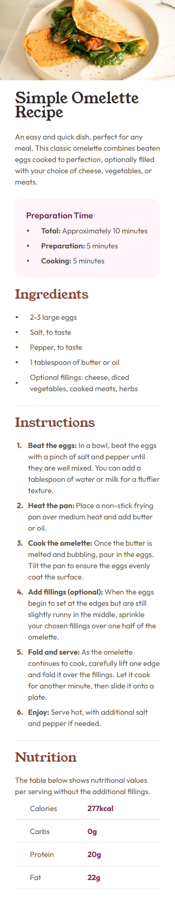
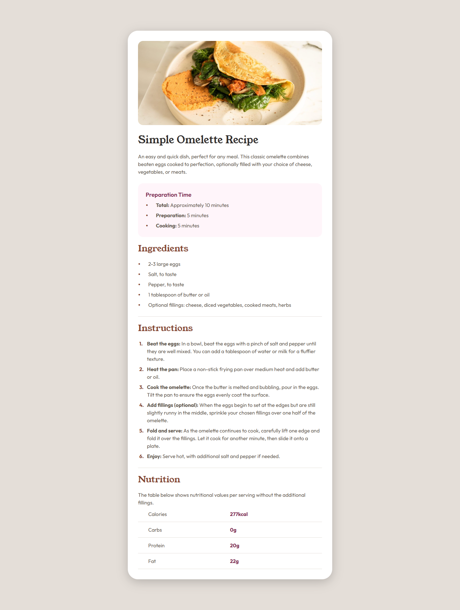

# Frontend Mentor - Recipe page solution

This is a solution to the [Recipe page challenge on Frontend Mentor](https://www.frontendmentor.io/challenges/recipe-page-KiTsR8QQKm). Frontend Mentor challenges help you improve your coding skills by building realistic projects. 

## Table of contents

- [Overview](#overview)
  - [The challenge](#the-challenge)
  - [Screenshot](#screenshot)
  - [Links](#links)
- [My process](#my-process)
  - [Built with](#built-with)
  - [What I learned](#what-i-learned)
  - [Continued development](#continued-development)
  - [Useful resources](#useful-resources)
- [Author](#author)

## Overview

### Screenshot

Mobile - 375px



Desktop - 1440px




### Links

- [Github Repo](https://github.com/Leondvin/recipe-page-solution)
- [Live Site URL - Github Pages](https://leondvin.github.io/recipe-page-solution/)

## My process

### Built with

- Semantic HTML5 markup
- CSS custom properties (variables)
- CSS function, `counter()`
- CSS reset - Eric Meyer
- Flexbox
- Mobile-first workflow

### What I learned

I used the `@import` at-rule to link the Google Fonts stylesheet. Since, it's put in the CSS, the file has to be loaded in order to link the stylesheet, contributing the load time. Instead, using `<link>` is recommended, unless otherwise specified.

```css
@import url('https://fonts.googleapis.com/css2?family=Outfit:wght@100..900&family=Young+Serif&display=swap');
```

I included the **child combinator**, `>`, to target all direct children of the parent, where `main` and `*` are the selectors.

```css
.recipe-title, .recipe-description, main > * {...}
```

**Selector list** is also used to target multiple elements with different classes and element types.

```css
.recipe-title, .recipe-description, main {...}
```

`` is an inline element by nature. It sits on the text baseline and has a small gap at bottom, to accomodate text descenders. To remove the gap I converted `` into a block-level element.

```css
img {
    display: block;
    /* CSS rules */
}
```

The `::before` pseudo-element is used the create a custom bullet point, to be used as flex item.

```css
.prep-time .prep-info::before, .ingredients li::before {
    content: "•";
    color: var(--brown-800);
    font-size: var(--font-size-md);
}
```

The `counter-reset` and `counter-increment` properties are used to create a counter and apply an increment to the counter respectively. The `counter()` function is used to return the current value of the named counter as a string.

```css
.instructions {
    counter-reset: section;
}
```

```css
.instructions p::before {
    counter-increment: section;  /* increments the counter by 1 */
    content: counter(section) ". ";
    /* CSS rules */
}
```

> `counter-reset` is used instead `counter-set`, since its newer and not widely available for browsers.

### Continued development

Reading the documentation regarding the accessibility, compatibility, etc. aspects of the newly experimented features may be beneficial for the future progress.

### Useful resources

- [MDN - `@import`](https://developer.mozilla.org/en-US/docs/Web/CSS/Reference/At-rules/@import)
- [MDN - `counter-reset`](https://developer.mozilla.org/en-US/docs/Web/CSS/Reference/Properties/counter-reset)
- [MDN - `counter-set`](https://developer.mozilla.org/en-US/docs/Web/CSS/Reference/Properties/counter-set)
- [MDN - `counter-increment`](https://developer.mozilla.org/en-US/docs/Web/CSS/Reference/Properties/counter-increment)
- [MDN - `counter()`](https://developer.mozilla.org/en-US/docs/Web/CSS/Reference/Values/counter)

## Author

- Github - [@Leondvin](https://github.com/Leondvin)
- Frontend Mentor - [@Leondvin](https://www.frontendmentor.io/profile/Leondvin)
